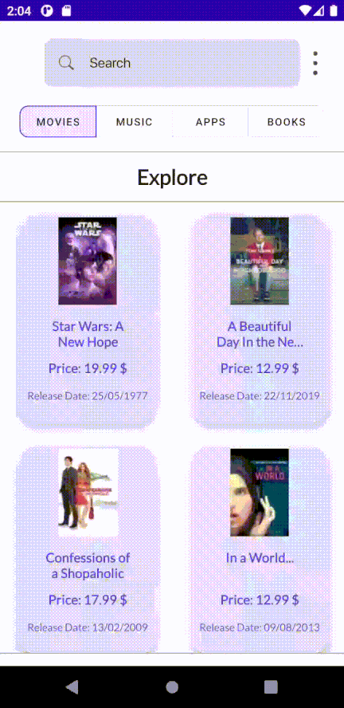
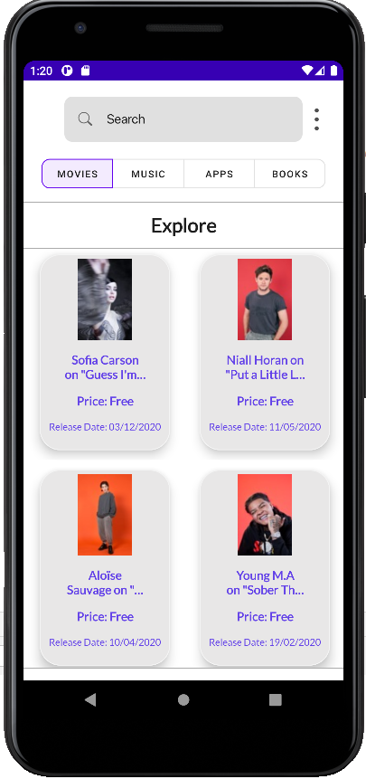
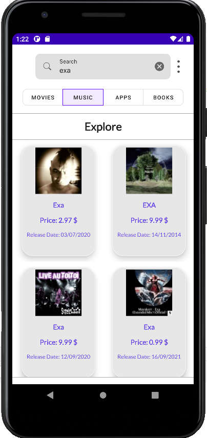

<h1>About</h1>

This app lists music, movies, books and apps available on itunes. In addition, users can see the details of the items in the lists. iTunes Search API is used for these.

 
<h2>Architecture Components</h2>

<ul>

<li>MVVM architecture to separate presentation layer (View) and business logic (ViewModel)</li>

<li>Paging 3.0 and Retrofit for retrieving data</li>

<li>Kotlin Coroutines for background operations.</li>

<li>The Navigation component to manage fragment operations</li>

<li>Data binding</li>

 
</ul>

<h1>Screenshots</h1>

